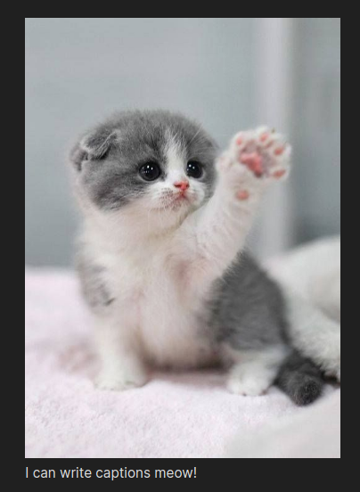

# Obsidian Image Caption

### Add captions to your images.



## Use

**Internal embeds**

Use the pipe (|) after the the source of an embeded image to display the text as a caption of the figure.

e.g.
```markdown
![[my_amazing_image.png|Check out this amazing picture.]]
```

**External embeds**

Use alt text to display as a caption.

e.g.
```markdown

```

## Settings

+ **Label:** Text that prepends all captions.<br/>
For automatic numbering use '#'. If a '#' character is meant to be output, escape it with a backslash ('\\'), i.e. '\\#'. Backslashes must also be escaped to be output, i.e.'\\\\'.

+ **CSS:** Apply custom CSS styling to the image captions.<br/>
Captions are indexed from 1 using the 'data-image-caption-index' attribute for styling based on figure number.

+ **Delimeter:** Indicates the caption text.<br/>
A delimeter is a set of characters that identify the caption text to use. The delimeter must enclose the text you wish to display as the caption.
	+ If no delimeter is set the entire text is used.
	+ A single delimeter can be used for the start and end.<br/>
    e.g. `"` -> `"My caption"` or `!!` -> `!!My caption!!`
	+ A start and end delimter can be used by separating them with a comma (,).<br/>
    e.g. `{, }` -> `{My caption}` or `<<, >>` -> `<<My caption>>`
	+ **Note:** Whitespace is trimmed from the delimeter character sets.
	+ **Note:** Only the first and last delimeters are matched, so the delimeter character can be used in the caption without special consideration, such as escaping.

## FAQ

+ **My captions aren't showing up:** Captions are only added if the image is rerendered. Try changing the caption (needs to be more than a trailing space) and trying again. If this fixes the issue then change it back, otherwise open an Issue.


## Known issues

+ Externally linked image captions do not update when changing between Preview and Edit mode. 
	+ This appears to be an issue with Obsidian and has been raised as a [bug report](https://forum.obsidian.md/t/alt-text-of-external-embed-des-not-update/28548).
